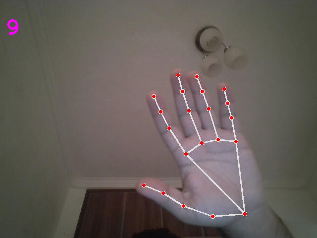
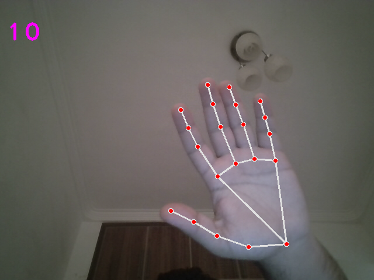
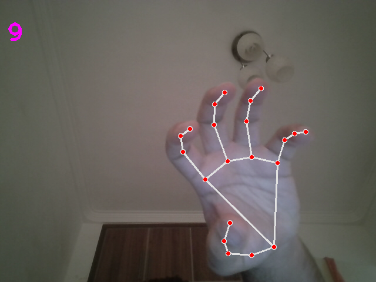
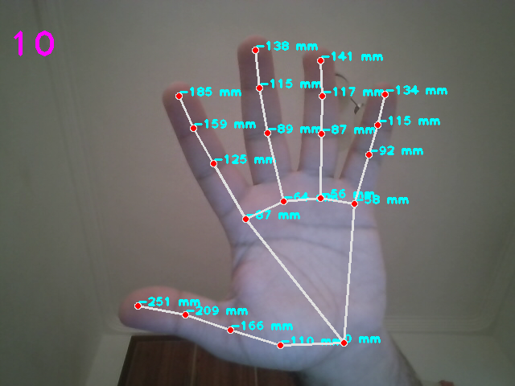

# 🖐️ Hand Tracking with OpenCV and MediaPipe

This project demonstrates real-time hand tracking using OpenCV and MediaPipe. The application captures video from the webcam, detects hands, and tracks their landmarks. It also displays the coordinates of the landmarks and the FPS (Frames Per Second) on the video feed.

## 📑 Table of Contents
- [⚙️ Installation](#installation)
- [📚 Usage](#usage)
- [📂 Project Structure](#project-structure)
- [✋ Hand Tracking](#hand-tracking)
- [📊 Visualization](#visualization)
- [🤝 Contributing](#contributing)
- [📄 License](#license)
- [💖 Donation](#donation)

## ⚙️ Installation

To run this project, you need to have Python 3.x installed along with the necessary libraries. You can install the required libraries using:

```bash
pip install opencv-python mediapipe
```

## 📚 Usage

1. Clone this repository:
    ```bash
    git clone https://github.com/esmail-sarhadi/Hand-Tracking-with-OpenCV-and-MediaPipe.git
    ```
2. Navigate to the project directory:
    ```bash
    cd Hand-Tracking-with-OpenCV-and-MediaPipe
    ```
3. Run the script:
    ```bash
    python hand_tracking.py
    ```

## 📂 Project Structure

- `hand_tracking.py`: Main script containing the code for hand tracking and visualization.
- `Image_screenshot_29.5.2024.png`: Screenshot showing hand tracking output.
- `Image_screenshot_29.06.2024.png`: Screenshot showing hand tracking output.
- `Image_screenshot_29.006.2024.png`: Screenshot showing hand tracking output.
- `Image_screenshot_29.۴06.2024.png`: Screenshot showing hand tracking output.

## ✋ Hand Tracking

The script captures video from the webcam and processes each frame using MediaPipe's hand tracking solution. It detects up to two hands and tracks their landmarks. The coordinates of each landmark are drawn on the video feed along with their z-coordinates.

## 📊 Visualization

The coordinates of the hand landmarks are displayed as circles on the video feed, and their z-coordinates are shown in millimeters. The FPS is also displayed in the top-left corner of the feed.

Here are some screenshots of the hand tracking in action:






## 🤝 Contributing

Contributions are welcome! Please open an issue or submit a pull request for any changes.

## 📄 License

This project is licensed under the MIT License - see the [LICENSE](LICENSE) file for details.

## 💖 Donation

If you found this project helpful, consider making a donation:

<a href="https://nowpayments.io/donation?api_key=REWCYVC-A1AMFK3-QNRS663-PKJSBD2&source=lk_donation&medium=referral" target="_blank">
     
</a>

